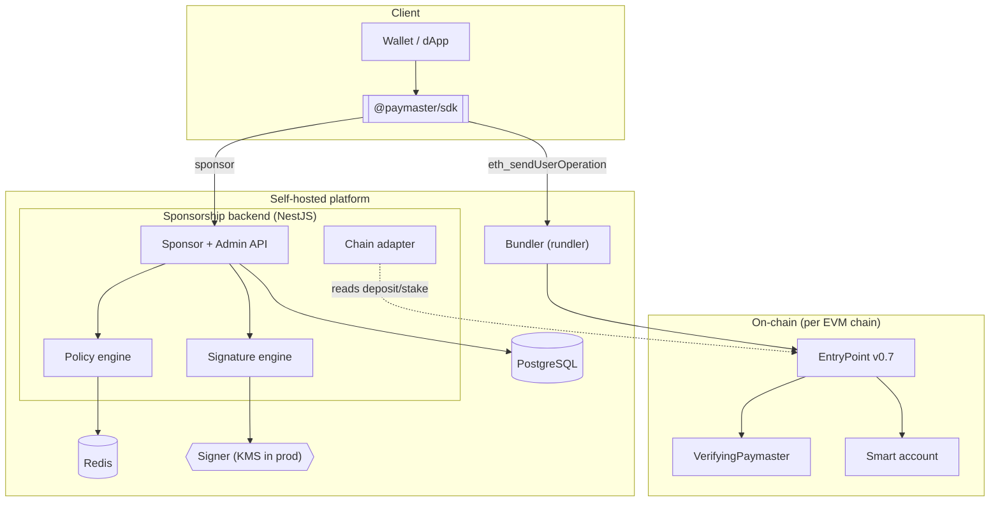
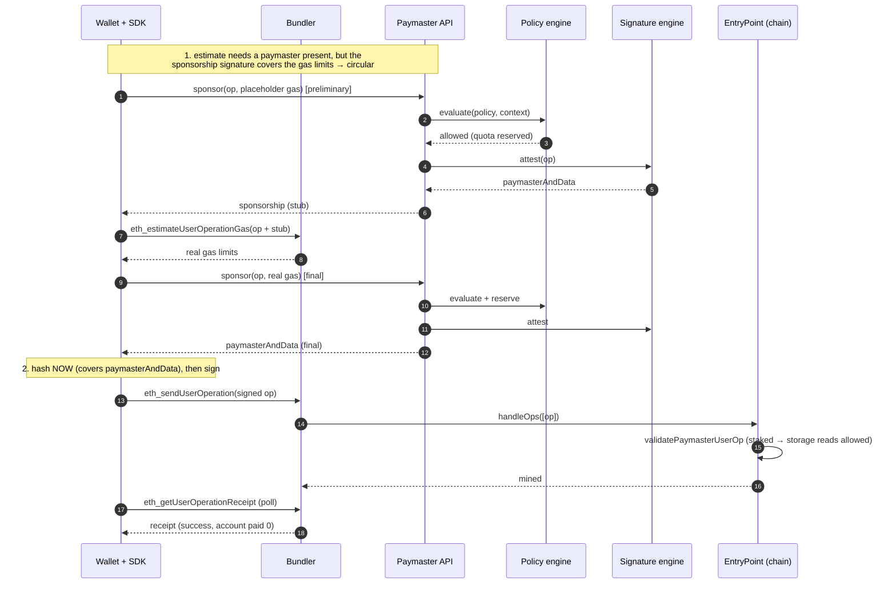
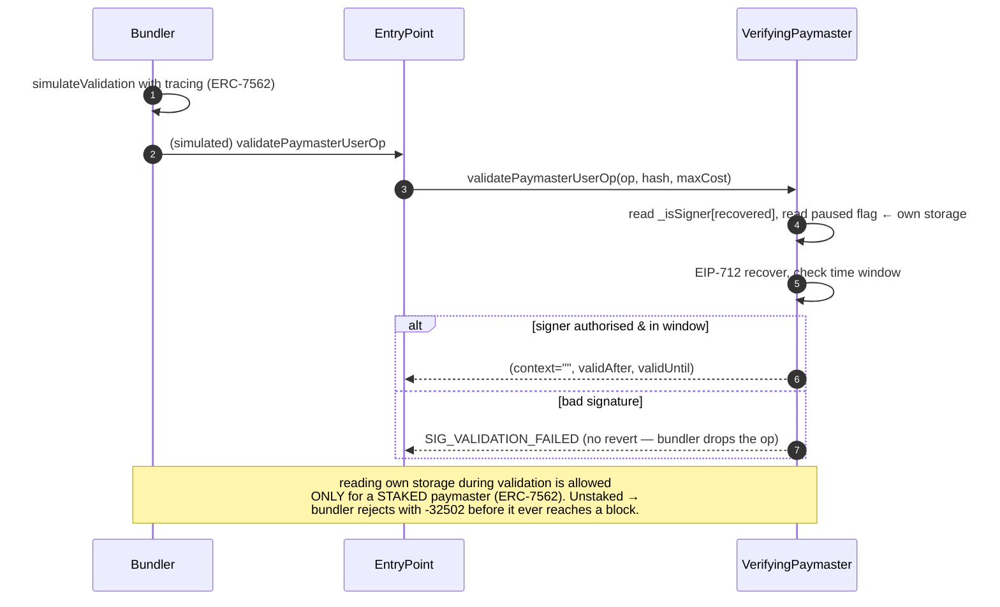

# Architecture

## Components



The **backend never touches the chain to sponsor.** It decides (policy) and signs (signature), and
returns `paymasterAndData`. The bundler is what submits to the EntryPoint. This separation is why
the paymaster can be sponsored for one chain and settled on another without the backend being in the
transaction path.

## Backend layering

Clean-architecture layering; the domain has no framework dependency, and NestJS is a thin adapter
over it (which is why the policy and signature engines are unit-tested without an HTTP server).

```
api/            NestJS controllers, guards, DTOs, error mapping  (HTTP adapter)
  ├── sponsor/      POST /paymaster/sponsor  → SponsorService
  ├── admin/        policy + key + reporting endpoints
  ├── guards/       API-key auth + RBAC
  └── filters/      domain error → HTTP status, without leaking policy shape
signature/      EIP-712 digest, paymasterAndData codec, signer port    (domain)
policy/         rules, quota stores, hot-reloadable PolicySource        (domain)
chain/          per-chain adapter, registry, maxCost                    (domain)
auth/           API-key hashing, RBAC permissions, authenticator        (domain)
db/             PostgreSQL repositories + migration runner              (adapter)
config/         env validation, bootstrap policy set                    (composition)
```

## The sponsorship request

What happens when a client asks the SDK to sponsor and send an operation. The ordering is the
subtle part — see the note after the diagram.



**Why this order is not negotiable.** The account signs a hash that *includes* `paymasterAndData`,
so the op must be sponsored before it is signed. The sponsorship signature *covers the gas limits*,
so the op must be estimated before it is sponsored. And estimation must see a paymaster or the
account is charged the prefund and validation reverts (AA23) — a smart account holds no ETH. The
resolution is the two-sponsorship dance above; `SponsoredBundlerClient` encapsulates it so a caller
cannot get it wrong.

## On-chain validation and the stake requirement



This is the single most important operational fact about this paymaster: **it must be staked.** It
reads its own storage (`_isSigner`, the pause flag) during validation, and ERC-7562 permits that
only for a staked entity. An unstaked deployment does not fail at deploy time or in any test that
calls `handleOps` directly — it fails at the bundler, which is measured in the test suite
(`backend/test/bundler.test.ts`): rundler returns `-32502 "entity stake/unstake delay too low"`.

The deploy script (`contracts/script/DeployPaymaster.s.sol`) therefore stakes as part of the deploy.

## Data model

Five tables (`backend/migrations/`):

- **api_keys** — SHA-256 hash only, never the key; roles as an array; `policy_id` FK with
  `ON DELETE RESTRICT` (deleting a pinned policy would silently unpin keys, a privilege escalation).
- **policies** / **policy_rules** — hot-reloadable policy definitions; rule config as JSONB validated
  in application code per rule type.
- **sponsorships** — every attestation issued. These are *commitments*, not spend: most never land.
  `max_cost_wei` is `NUMERIC(78,0)`, never `BIGINT` — BIGINT overflows at ~9.22 ETH.
- **audit_logs** — append-only; credential values redacted at write time.

Quota counters live in **Redis**, not Postgres: a write per request on a hot counter row would be the
system's bottleneck, and Redis's atomic Lua `tryConsume` is what makes a quota hold across replicas.
Spend is counted in **gwei**, not wei — Redis `INCRBY` is a signed 64-bit integer and overflows at
~9.22 ETH in wei, and Redis Lua's doubles lose precision on wei amounts silently.

## Deployment

### Development

`docker-compose.yml` brings up postgres, redis, anvil, the bundler, and the backend. `deploy/local-setup.sh`
produces the on-chain state (EntryPoint, factory, a staked paymaster, an account) and writes
`deploy/.env.local` for everything to share.

> The Compose stack's individual components are all verified running outside Docker; the composed
> stack has not been booted end-to-end in the development environment used to build this (no Docker
> daemon). Treat the first `docker compose up` as unverified.

### Production (intended shape, not yet built)

- Backend as a horizontally scaled Deployment (stateless; state is Postgres + Redis). Migrations run
  at boot, serialised across replicas by a Postgres advisory lock.
- Bundler as its own Deployment per chain; rundler can split `pool` / `builder` / `rpc` processes.
- Signer via KMS (the `SponsorshipSigner` port exists; the adapter does not).
- Kubernetes/Helm charts — **not yet written.**

## Configuration

Everything security-relevant fails closed and has no default: a missing `SPONSORSHIP_SIGNER_KEY`,
`BOOTSTRAP_API_KEY`, or `CHAINS` is a startup crash, never a silent insecure default. See
`backend/.env.example`. Chains are added by extending `CHAINS` JSON — no code change.
