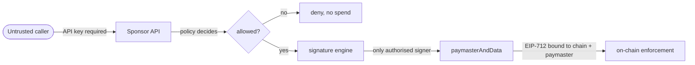

# Security & Threat Model

This document collects the security-relevant design decisions. Many are enforced by a specific test;
where so, the test is named. The threat this platform exists to contain is simple to state: **the
paymaster spends real money on behalf of untrusted callers.** Almost every decision below follows
from bounding that.

## Trust boundaries

- The **contract** is the enforcement boundary. It does not decide policy; it proves an authorised
  signer agreed to *this exact operation* within a time window. Policy is off-chain and unforgeable
  because forging it requires the signer key.
- The **API** is the spend boundary. Without a valid key you cannot ask for sponsorship; within
  policy you can spend the deposit up to your quotas.

## Contract

### Signature binding

The sponsorship is an EIP-712 typed-data signature. It is bound to:

| Bound to | By | Prevents |
| --- | --- | --- |
| chain | EIP-712 domain `chainId` | replay on another chain |
| this deployment | EIP-712 domain `verifyingContract` | replay against a sibling paymaster |
| sender + nonce | signed fields; EntryPoint rejects nonce reuse | replay for the same account |
| every gas field, incl. **paymaster gas limits** | signed struct | a bundler inflating `postOpGasLimit` against a signature that never agreed |
| callData, initCode | signed hashes | swapping the operation under a valid signature |

There is deliberately **no paymaster-side nonce**: `sender + nonce` plus the EntryPoint's own
nonce-reuse rejection already close the replay window, and an SSTORE per operation would buy nothing.
`VerifyingPaymaster.t.sol` proves each binding (tampered callData, tampered gas limits,
cross-paymaster, cross-chain, replay). The gas-limit binding was mutation-verified: removing it from
the signed struct passes the happy-path test and fails only the tamper test.

### The stake requirement (mandatory, not optional)

The contract reads its own storage during validation. ERC-7562 permits that only for a staked
paymaster. **An unstaked deployment is silently rejected by every conforming bundler** — it does not
fail at deploy or in a direct-`handleOps` test. Measured in `bundler.test.ts`: rundler returns
`-32502` with the paymaster's own address and the storage slot. The deploy script stakes as part of
the deploy so this cannot be forgotten.

### Fail-safe controls

- **Emergency pause** — halts all sponsorship immediately (on-chain, faster than any policy reload).
- **Two-step ownership** — a typo'd owner transfer cannot brick a funded paymaster.
- **Rotatable signer set** — add the new signer, drain in-flight signatures, revoke the old, with
  zero downtime. (The reference VerifyingPaymaster uses an immutable signer, which cannot rotate.)
- **Custom errors, events on every state change** — for on-chain observability and cheaper reverts.

## Backend

### Authentication

- **API keys are 256-bit CSPRNG values, stored only as SHA-256.** A database dump yields no usable
  credential. SHA-256, not bcrypt/argon2, is correct here: slow hashes defend *low-entropy* secrets
  against brute force, but a 256-bit key has no dictionary to slow, and bcrypt-per-request at
  thousands of ops/min would be a self-inflicted DoS. The property that matters — the raw key is
  never stored — holds regardless.
- **Uniform failure.** Every authentication failure returns a byte-identical `401`. Distinguishing
  "unknown" from "revoked" from "expired" tells someone testing a leaked key whether it was ever
  real. The specific reason goes to an observer (for alerting), never to the caller.
  (`auth.test.ts`, `api.test.ts`.)
- **RBAC on permissions, not roles.** Handlers require a permission (`sponsor:create`, `policy:write`,
  …); roles are bundles of permissions. Permission failures are `403` and *do* name the missing
  permission — that describes the caller's own key, not the policy set.

### Authorization / anti-escalation

- **A key's pinned `policyId` overrides the request body's.** Otherwise a key scoped to a strict
  policy could name a permissive one in the body and escape its quotas. (`api.test.ts`.)
- **Deleting a policy a key is pinned to fails (`409`).** Under `ON DELETE CASCADE` it would unpin
  those keys, and an unpinned key may name any policy — a delete becoming an escalation.
  (`admin.test.ts`, DB `ON DELETE RESTRICT`.)

### Fail closed

- **A policy rule that throws denies.** Treating an evaluation error as a pass would turn a quota-store
  outage into unlimited free gas. (`policy.test.ts`.)
- **A rule that cannot be built aborts the whole reload.** Skipping an unrecognised rule would yield a
  policy that sponsors blocked senders or has no spend cap. `PolicySource` keeps the last good set on
  a failed reload, so the failure mode is "stale policy", never "policy missing a rule".
  (`policyFactory.test.ts`, `admin.test.ts`.)
- **A sponsorship that cannot be recorded is not returned.** Recording is awaited before the
  attestation is handed back, trading availability for auditability: "we paid and cannot say why" is
  permanent and unbounded; "we declined for ten minutes" is neither. A recording failure releases the
  reserved quota. (`sponsorService.test.ts`.)
- **Missing security config is a crash, not a default.** No signer key, bootstrap key, or chains → the
  service refuses to start. A misconfigured money-spending service should be unreachable, not open.

### Anti-abuse

- **Quotas** per wallet, IP, API key, chain, target, and global — as operations or as spend. Enforced
  atomically in Redis so the limit holds across replicas; a client-side check-then-increment
  over-grants under concurrency (mutation-verified: 200 concurrent requests all admitted against a
  limit of 5). An absent subject *denies* by default rather than silently not applying.
- **Spend caps round conservatively** — charge rounds up, limit rounds down, both toward spending
  less than configured. A cap bypassable by making requests small is not a cap. (`redis.test.ts`.)
- **Input validation** at the boundary (zod); quantities are hex/decimal strings, never JSON numbers
  (a fee above 2^53 would round). **Address allowlists are EIP-55 checksum-verified** — `getAddress`
  alone silently "fixes" a typo, so a mistyped allowlist entry would allowlist the wrong contract.
- **Parameterised SQL everywhere** — no string interpolation reaches a query. (`db.test.ts` includes
  an injection-shaped input.)
- **Audit log redacts credentials at write time** — a secret that reaches the table is already leaked;
  redaction on read would be too late.

## Disclosure policy

The error filter returns a stable machine code, never an internal reason:

| Caller sees | Internal (log/observer) |
| --- | --- |
| `SPONSORSHIP_DENIED` + code (`SENDER_BLOCKED`, `QUOTA_EXCEEDED`, …) | which rule, which threshold, current usage |
| uniform `401` | which auth check failed |

The code tells a legitimate integrator what to fix; the reason would help an attacker map the policy
set. (`api.test.ts` asserts the reason never reaches the response.)

## Known gaps (must close before production)

- **Signer key in process memory.** Held in heap, reachable from a core dump. The `SponsorshipSigner`
  port is shaped for a KMS/HSM adapter; that adapter is not written.
- **No JWT admin auth, no request signing, no circuit breakers, no pre-auth IP throttling.** The
  per-IP quota runs *after* authentication, so it does not protect the auth path itself.
- **Spend caps charge worst-case cost.** Actual gas is always lower (proven in `maxCost.test.ts`), so
  caps run conservative and drift; true accounting needs a `UserOperationEvent` reconciliation loop.
- **No automated deposit/stake monitoring or alerting.** The chain adapter can read funding; nothing
  watches it.
- **Test coverage has not been measured.** Do not cite a coverage figure that has not been produced.

## Responsible operation

- Fund the paymaster deposit and **stake it** (deploy script does both). Monitor both — a drained
  deposit stops sponsorship, an unstaked paymaster is unbundleable.
- Rotate the sponsorship signer periodically using the add-drain-revoke flow.
- Keep quotas and spend caps set; an unbounded "sponsor everyone" policy is a faucet.
- Use a multisig owner in production. Keep the emergency-pause path tested and reachable.
